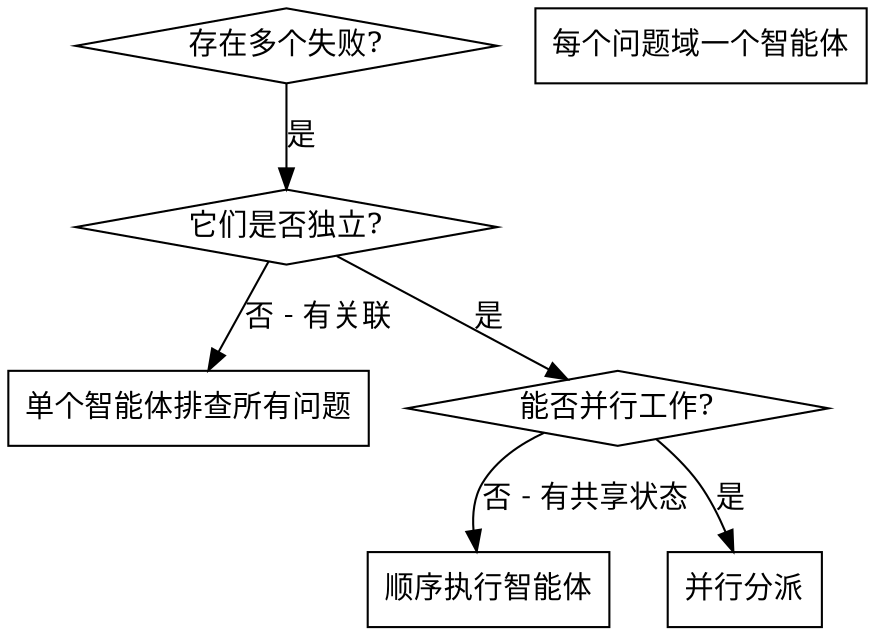

# 并行分派智能体

## 概述

你将任务委派给具有隔离上下文的专用智能体。通过精心设计它们的指令和上下文，确保它们专注并成功完成任务。它们不应继承你的会话上下文或历史记录——你要精确构造它们所需的一切。这样也能为你自己保留用于协调工作的上下文。

当你遇到多个不相关的失败（不同的测试文件、不同的子系统、不同的 bug），逐一排查会浪费时间。每个排查都是独立的，可以并行进行。

**核心原则：** 每个独立问题域分派一个智能体，让它们并发工作。

## 何时使用



**适用场景：**
- 3 个以上测试文件因不同根因失败
- 多个子系统独立出现故障
- 每个问题无需其他问题的上下文即可理解
- 排查之间无共享状态

**不适用场景：**
- 失败是相关的（修复一个可能修复其他的）
- 需要理解完整的系统状态
- 智能体之间会互相干扰

## 模式

### 1. 识别独立的问题域

按故障分组：
- 文件 A 测试：工具审批流程
- 文件 B 测试：批量完成行为
- 文件 C 测试：中止功能

每个问题域是独立的——修复工具审批不会影响中止测试。

### 2. 创建聚焦的智能体任务

每个智能体获得：
- **明确范围：** 一个测试文件或子系统
- **清晰目标：** 让这些测试通过
- **约束条件：** 不修改其他代码
- **预期输出：** 你发现和修复内容的总结

### 3. 并行分派

```typescript
// 在 Claude Code / AI 环境中
Task("修复 agent-tool-abort.test.ts 的失败")
Task("修复 batch-completion-behavior.test.ts 的失败")
Task("修复 tool-approval-race-conditions.test.ts 的失败")
// 三个任务并发运行
```

### 4. 审查与集成

当智能体返回时：
- 阅读每个总结
- 验证修复之间没有冲突
- 运行完整测试套件
- 集成所有更改

## 智能体提示词结构

好的智能体提示词应该是：
1. **聚焦的** - 一个清晰的问题域
2. **自包含的** - 包含理解问题所需的所有上下文
3. **明确输出要求** - 智能体应该返回什么？

```markdown
修复 src/agents/agent-tool-abort.test.ts 中 3 个失败的测试：

1. "should abort tool with partial output capture" - 期望消息中包含 'interrupted at'
2. "should handle mixed completed and aborted tools" - 快速工具被中止而非完成
3. "should properly track pendingToolCount" - 期望 3 个结果但得到 0 个

这些是时序/竞态条件问题。你的任务：

1. 阅读测试文件，理解每个测试验证的内容
2. 找到根因——是时序问题还是实际 bug？
3. 修复方式：
   - 用基于事件的等待替换任意超时
   - 如果发现中止实现中的 bug 则修复
   - 如果测试的是已变更的行为则调整测试期望

不要只是增加超时时间——找到真正的问题。

返回：你发现了什么以及修复了什么的总结。
```

## 常见错误

**错误做法：太宽泛：** "修复所有测试" - 智能体会迷失方向
**正确做法：具体明确：** "修复 agent-tool-abort.test.ts" - 聚焦的范围

**错误做法：无上下文：** "修复竞态条件" - 智能体不知道在哪里
**正确做法：提供上下文：** 粘贴错误信息和测试名称

**错误做法：无约束：** 智能体可能会重构所有代码
**正确做法：设置约束：** "不要修改生产代码" 或 "只修复测试"

**错误做法：模糊的输出要求：** "修好它" - 你不知道改了什么
**正确做法：明确要求：** "返回根因和修改内容的总结"

## 不适用的场景

**关联性失败：** 修复一个可能修复其他的——先一起排查
**需要完整上下文：** 理解问题需要看到整个系统
**探索性调试：** 你还不知道什么坏了
**共享状态：** 智能体会互相干扰（编辑同一文件、使用同一资源）

## 实际案例

**场景：** 大规模重构后，3 个文件中出现 6 个测试失败

**失败情况：**
- agent-tool-abort.test.ts：3 个失败（时序问题）
- batch-completion-behavior.test.ts：2 个失败（工具未执行）
- tool-approval-race-conditions.test.ts：1 个失败（执行计数 = 0）

**决策：** 独立的问题域——中止逻辑、批量完成、竞态条件各自独立

**分派：**
```
智能体 1 → 修复 agent-tool-abort.test.ts
智能体 2 → 修复 batch-completion-behavior.test.ts
智能体 3 → 修复 tool-approval-race-conditions.test.ts
```

**结果：**
- 智能体 1：用基于事件的等待替换了超时
- 智能体 2：修复了事件结构 bug（threadId 位置不对）
- 智能体 3：添加了等待异步工具执行完成的逻辑

**集成：** 所有修复互相独立，无冲突，完整测试套件全部通过

**节省的时间：** 3 个问题并行解决 vs 顺序解决

## CEO 委派模式（大型任务）

当用户说"你做主"、"你自己来"、或任务涉及 3+ 独立模块的实现时，切换到 CEO 模式：

**你的角色：架构师 + 决策者，不是码农。**

1. **你做设计决策** — 写架构设计文档（接口、数据流、优先级）
2. **小弟写代码** — 每个模块一个子任务并行委派
3. **审查小弟用不同模型** — 用户明确说过："分析审查多让子任务和分身做，他们调用免费模型轮询。会看到不一样的问题。"
4. **你做最终集成** — 审查结果、修复 bug、决策取舍

```
CEO (你)                    子任务 (并行)
├── 架构设计                   ├── 模块 A 实现
├── 优先级决策                  ├── 模块 B 实现
├── 审查 & 集成                ├── 模块 C 实现
└── 测试 & 部署                └── 代码审查 (不同模型)
```

### 多角度代码审查（17+ 个审查视角）

子任务审查能发现你自己看不到的问题。用户明确说过：**"分析审查多让子任务和分身做，他们调用免费模型轮询。会看到不一样的问题。"**

**核心原则：不同视角找不同类型的问题。**

**推荐审查视角（按轮次组织）：**

| 轮次 | 视角 | 关注点 |
|------|------|--------|
| 第1轮 | 安全审计 | 路径遍历、命令注入、属性覆写、信息泄露 |
| 第1轮 | API 设计 | 接口一致性、命名规范、错误处理、类型提示 |
| 第1轮 | 性能优化 | O(n²)算法、regex预编译、I/O模式、缓存机会 |
| 第2轮 | 边界猎手 | None输入、空值、Unicode、零除、类型错误 |
| 第2轮 | 数据完整性 | 可变默认参数、共享引用、原子写入、时区问题 |
| 第2轮 | 测试覆盖 | 未测试的公共方法、错误路径、边界值 |
| 第3轮 | 可用性 | 从使用者角度审查API、便利方法、错误信息质量 |
| 第3轮 | 测试质量 | 掩盖失败的try/except、硬编码值、不稳定测试 |
| 第3轮 | 跨模块合约 | 模块间数据兼容性、接口契约 |
| 第4轮 | 功能增强 | 实际功能缺口（不是bug修复，是缺失能力） |
| 第4轮 | 回归检查 | 脆弱测试、环境依赖、重复测试 |
| 第5轮 | 并发正确性 | 线程安全、竞态条件、锁顺序、死锁 |
| 第5轮 | 错误处理 | except块、资源泄漏、traceback丢失、graceful降级 |
| 第5轮 | 代码一致性 | 重复代码消除、命名一致性、共享工具提取 |
| 第6轮 | Python最佳实践 | slots=True、__all__、context manager、pathlib |
| 第6轮 | 部署就绪 | 无界缓存、信号处理、环境变量、健康检查 |
| 第6轮 | 算法正确性 | 数学验证、TF-IDF归一化、熔断器状态机 |

**流程：**
1. 实现子任务完成后，每轮派 2-3 个并行审查子任务（不同视角）
2. 每个审查子任务读所有源码和测试，输出 MUST_FIX / SHOULD_FIX / NICE_TO_HAVE
3. **审查子任务直接修复 CRITICAL/HIGH bug**（不只是报告）
4. 每轮修复后，同步到测试服务器跑全量测试
5. 测试全绿再进入下一轮
6. 最后用 **多模型共识审查** 做最终检查（见下文）

**实际效果（Hermes 2.0 项目）：**
- 17 轮审查发现 70+ bugs
- 2 CRITICAL 安全漏洞（路径遍历、属性覆写）
- 4 HIGH 性能优化（regex预编译、O(n²)→O(n)、原子写入）
- 4 HIGH 并发修复（竞态条件、线程安全锁）
- 3 CRITICAL 错误处理（子进程泄漏、futures挂起、部分损坏恢复）
- 测试从 307 增长到 859（填补覆盖空白）

### 多模型共识审查（最终检查）

在所有角度审查完成后，用 **多个不同的 LLM** 做最终全量审查。不同模型擅长发现不同类型的问题。

**可用模型来源：**
- Kiro Gateway (kiro-gateway:8000): claude-sonnet-4.5, deepseek-3.2, qwen3-coder-next
- CLI Proxy API (cli-proxy:8317): NVIDIA NIM 等
- 其他自定义提供商

**流程：**
1. 写一个 Python 脚本，调用 API 把源码发给模型做审查
2. 每个模型独立审查，输出 Top 10 发现
3. 汇总共识（多个模型都指出的问题 = 最高优先级）
4. 修复共识问题，跑测试验证

**示例脚本模式：** 参见 `agents-code-reviewer` 技能的 `references/multi-model-review-session-log.md` — 包含 24 轮审查的实战数据（7 个模型、110+ bugs、模型→角度匹配表）。

**实际效果（Hermes 2.0 项目）：**
- Claude Sonnet 4.5: 发现 Pipeline 流式缺陷 + 内存合并 O(n²)
- DeepSeek 3.2: 发现 Pipeline 流式缺陷 + StreamingToolExecutor 内存泄漏
- Qwen3-Coder: 发现除零风险 + 竞态条件
- **共识**：3 个模型都指出的问题 = 必须修复

### 关键约束

- **不动生产代码** — 在隔离目录/仓库开发，测试通过后再集成
- **远程测试** — 用非生产服务器验证（不同环境能暴露不同问题）
- **先修后测** — 审查发现的 bug 必须修完再声称"完成"

### 远程测试工作流

当需要在多台服务器验证时：
```
1. 本地开发（隔离目录，不动生产代码）
2. SCP 同步到测试服务器: scp -r ./module user@test-server:/path/
3. SSH 运行测试: ssh user@test-server 'cd /path && python3 -m pytest tests/ -v'
4. 测试全绿 → 推 GitHub
5. 重复：审查 → 修 → SCP → 测试 → 推送
```

**注意 pytest-asyncio 依赖问题：** 如果测试服务器没有 pytest-asyncio，用 `asyncio.run()` 包装代替 `@pytest.mark.asyncio` 装饰器，保持零外部测试依赖。

**PYTHONPATH 多路径问题：** 测试文件可能用不同风格导入（`from module import ...` vs `from hermes_upgrades.module import ...`），需要同时设置多个路径：
```bash
PYTHONPATH=src:src/hermes_upgrades:src/hermes2 python3 -m pytest tests/ -q
```

### 独立增强模块模式

当需要迭代升级现有系统但不能修改生产代码时：
1. 在独立目录创建增强模块（drop-in，不导入原代码）
2. 每个模块独立可测试，接口统一
3. 最后写一个适配器（Adapter）把所有模块粘合在一起
4. 适配器提供统一引擎接口，一行配置启动全部增强

```
enhancement_dir/
├── module_a.py          # 独立模块
├── module_b.py          # 独立模块
├── adapter.py           # 统一引擎接口
├── tests/               # 每个模块的测试
│   ├── test_module_a.py
│   ├── test_module_b.py
│   ├── test_integration.py   # 集成测试
│   └── test_contracts.py     # 跨模块合约测试
└── DOCS.md              # 中文文档
```

## 核心优势

1. **并行化** - 多个排查同时进行
2. **聚焦** - 每个智能体范围窄，需要跟踪的上下文少
3. **独立性** - 智能体之间互不干扰
4. **速度** - 3 个问题在 1 个问题的时间内解决
5. **多视角** - 不同模型审查发现不同问题（CEO 委派模式特有）

## 验证

智能体返回后：
1. **审查每个总结** - 理解改了什么
2. **检查冲突** - 智能体是否编辑了同一段代码？
3. **运行完整套件** - 验证所有修复协同工作
4. **抽查** - 智能体可能犯系统性错误

## 实际效果

来自调试会话（2025-10-03）：
- 3 个文件中 6 个失败
- 并行分派 3 个智能体
- 所有排查并发完成
- 所有修复成功集成
- 智能体之间的更改零冲突

## Pitfalls

- **子代理超时（delegate_task timeout）** — 当 orchestrator 模型较慢（如 mimo-v2.5-pro）时，子代理经常 30s 超时。**回退方案：直接用 curl 调模型 API**，不用 delegate_task。代码审查场景特别适合这种模式：读文件 → 拼成 prompt → curl 发给 Kiro Gateway / CLI Proxy API → 解析返回。
- **模型死循环** — Qwen3-Coder 等模型在大 prompt 代码审查时可能进入无限重复循环（同一段内容反复输出）。**缓解：** 在 prompt 中明确 "Output only once, do not repeat"，并设置较低的 max_tokens。
- **curl JSON 转义** — 把代码拼进 JSON payload 时，用 Python 的 `json.dumps()` 做转义，不要手动拼字符串或用 jq 的 `--arg`（大代码块会出问题）。
- **远程服务器 pytest 未安装** — 新服务器需要 `pip3 install --break-system-packages pytest`（PEP 668 限制）。

## References

- `references/cli-proxy-model-access.md` — CLI Proxy API model access patterns
- `references/curl-based-code-review.md` — Direct curl API fallback when subagents timeout
- `references/parallel-execution-pitfalls.md` — 17-model parallel execution template, model inventory, timeout pitfalls
